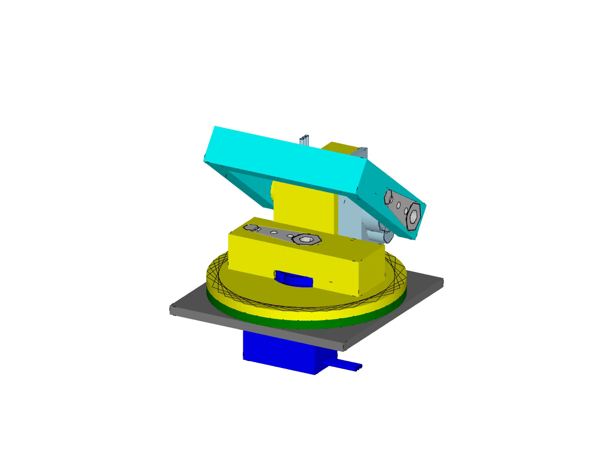
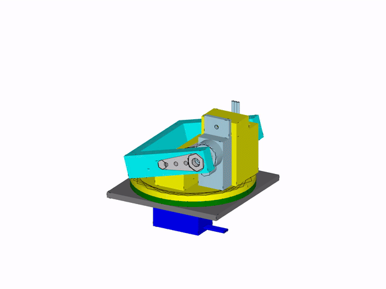
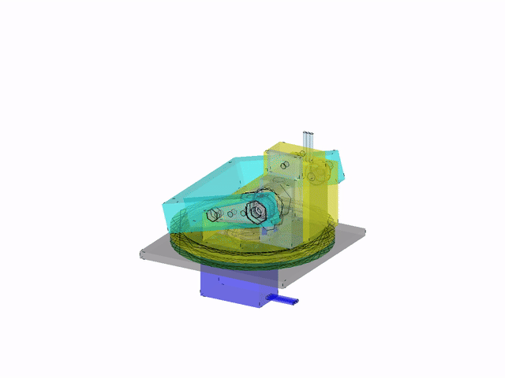

# pantilt-build123d

Pan-tilt geometry and modeling using [build123d](https://github.com/gumyr/build123d).

A two-axis (pan + tilt) servo mount built around SG90-class hobby servos, with a
360° continuous pan stage, a dual-supported tilt yoke (driven shaft + collinear
counter-shaft), and co-printed structural parts.



## Preview

<table>
  <tr>
    <td align="center"><br><sub>opaque</sub></td>
    <td align="center"><br><sub>see-through</sub></td>
  </tr>
</table>

Headless VTK render (1280×960) sweeping the joint limits — pan −90…+90°, tilt
−15…+90°. Full-quality MP4:
[opaque](https://github.com/a-dh/Pantilt_build123d/releases/download/v0.1.0/pantilt_opaque.mp4)
·
[see-through](https://github.com/a-dh/Pantilt_build123d/releases/download/v0.1.0/pantilt_transparent.mp4).

## Scripts

| Script | What it does |
|---|---|
| `src/pantilt_build123d/pan_tilt_assembly.py` | Builds the full assembly. `build_assembly()` returns the parts and kinematic joints; running it directly shows the model in the [OCP CAD Viewer](https://github.com/bernhard-42/vscode-ocp-cad-viewer). |
| `animate_joints.py` | Drives the assembly through a synchronized pan/tilt sweep in the viewer (joint-driven). |
| `render_video.py` | Renders the pan/tilt motion to headless MP4 clips (opaque + transparent) via VTK + ffmpeg. |
| `make_media.py` | Derives the README preview assets (`docs/media/` GIFs + hero PNG) from the rendered MP4s via ffmpeg. |
| `export_ros2.py` | Exports a tf-compatible ROS2 description (URDF + STL meshes). |
| `export_parts.py` | Exports the printed parts (STEP / 3MF / STL) in design orientation for slicing. |

```bash
python -m pantilt_build123d.pan_tilt_assembly   # static view
python animate_joints.py      # animated view
python render_video.py        # MP4 clips -> ./videos  (QUICK=1 for a fast smoke test)
python make_media.py          # preview GIFs + hero PNG -> ./docs/media
python export_ros2.py         # ROS2 export -> ./pantilt_description
python export_parts.py        # printed parts -> ./export
```

## ROS2 export

`export_ros2.py` writes a ROS-package-style description that imports cleanly into
RViz / robot_state_publisher and resolves through `tf2`:

```bash
python export_ros2.py [output_dir]    # default: ./pantilt_description
```

```
<output_dir>/
  meshes/  base_link.stl  mount_plate.stl  pan_link.stl  tilt_link.stl
  urdf/    pantilt.urdf
```

### Kinematic tree

```
base_link            pan servo + static bearing        (root / fixed base)
 |- mount_plate      host mounting plate               fixed     (separable)
 |- pan_link         upper bracket, tilt servo,        continuous  +Z  (pan)
 |   |               pan horn, counter-shaft rod
 |   |- tilt_link    tilt yoke + tilt horn             revolute    +Y  (tilt)
```

The mounting plate is its own fixed, **separable** link — drop it if you mount
the unit some other way. Everything else (`base_link`, `pan_link`, `tilt_link`)
is the controllable robot.

### tf compatibility

Every link frame is identity-oriented and placed on the joint axis it rotates
about, so joint origins are plain translations and axes are unit vectors. At the
zero joint pose each link's mesh plus its cumulative joint origin reconstructs the
as-built geometry. Meshes are in millimetres and referenced with
`scale="0.001 0.001 0.001"`; joint origins are in metres.

### Using it in a ROS2 workspace

Mesh paths use `package://pantilt_description/...`, so make the export available
as a package (or adjust the `PACKAGE` constant / output dir to match your
package name). Then, e.g.:

```bash
ros2 launch <your_pkg> display.launch.py        # robot_state_publisher + RViz
# or quick check:
check_urdf pantilt_description/urdf/pantilt.urdf
ros2 run joint_state_publisher_gui joint_state_publisher_gui
```

`pan_joint` and `tilt_joint` are the actuated joints. The servo torque/velocity
limits (`EFFORT_NM`, `VELOCITY_RAD_S` in `export_ros2.py`) are placeholders —
set them to your actual servo specs.

## Development

```bash
python -m venv venv && source venv/bin/activate
pip install -e .
```

CAD exports (`*.stl`, `*.step`, `*.3mf`) and rendered videos (`videos/`,
`*.mp4`), along with the ROS2 description (`pantilt_description/`), are
regenerable artifacts and are git-ignored; rerun the relevant export/render
script to recreate them. The committed README preview assets in `docs/media/`
are regenerated with `python make_media.py` (after `render_video.py`).
